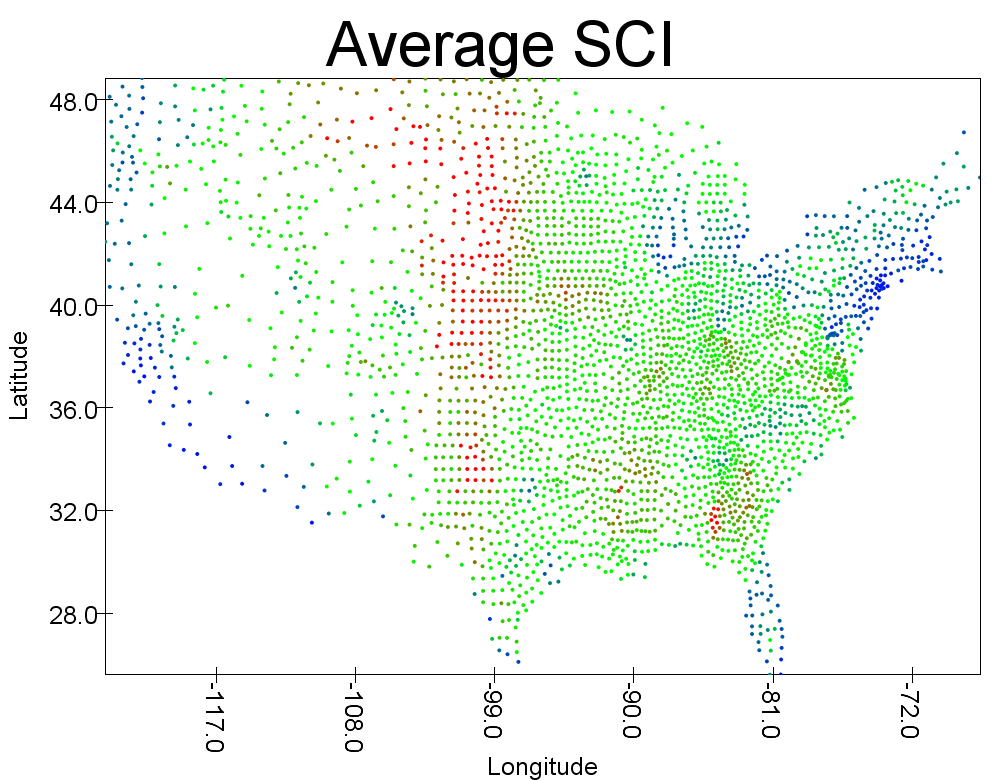

# Data Analysis of the Social Connectedess Index of Counties in the United States  

### Questions I Hoped to Answer
Broadly speaking, I expected that I'd be able to use this dataset (and others) to demonstrate that Social Connectedness Index (SCI) is a good indicator of homophily in action. In other words, given two counties with a high SCI, I suspected that they would share various similarities. In terms of specific goals, I primarily had a particular interest in the correlation between COVID-19 response/attitudes and SCI which is why I attempted to use public opinion on mask-wearing to classify counties into highly connected and not highly connected groups and SCI to classify counties into pro-mask and anti-mask groups. In light of the events of 2020, I felt it was a good idea to be able to determine either how relatively tuned into Facebook a given county is or how a given county feels about masks. Secondly, I wanted to create a good predictor of SCI given any two counties and using regression. This task is the one I wanted to use to test for homophily most directly. Due to the nature of dealing with a pair of counties, any data that goes into such a regression has to be a comparison of a measure taken from each county in question, so similarities are very impactful. Additionally, while playing with the data, I came across some interesting artifacts which lead me to ask a some more general questions. For example, I noticed that SCI values drop off a cliff when crossing state borders. I was curious as to whether this behavior holds true for most states. I ended up demonstrating this using examples, but was unable to use any sort of clustering algorithm as I had hoped to do. I'll explain further in later sections.

### Datasets Used
The main dataset that I used was the Facebook Social Connectedness Index dataset for August of 2020. This dataset gives an anonymized snapshot of SCI values between all counties in the United States using FIPS codes as identifiers. The data includes a small amount of random noise to help with anonymization. Each line contains two FIPS codes and a SCI value. The SCI between *countyi* and *countyj* is calculated using *SCIi,j = Connectionsi,j/(UsersixUsersi)*. As such, a single SCI value means nothing but for its relationship to other SCI values. In other words, if County A has twice the SCI with County B as it has with County C, a Facebook user in County A is twice as likely to be Facebook friends with someone in County B as they are to be Facebook friends with someone in County C. These values were then scaled to be integers between 1 and 1,000,000,000. It should be noted that Alaska and Hawaii were simultaneously uninteresting and a pain to deal with, so I chose to only work with the contiguous United States. I also used a dataset from the New York Times COVID-19 repository that tracks mask attitudes in US counties by their FIPS codes. For each FIPS code, there are 5 values (never, rarely, sometimes, frequently, always) that add to 1.0 and represent how often people wear masks. Other datasets were used to bring in various other values such as unemployment rates, populations, election results from 2016, and county geographic/population centers in coordinates of U.S. counties, but they're pretty straightforward.

### Classification
To start off this analysis, I first mapped each county to an average of its SCI values since the objective was to classify counties, not county-county pairs. This produces the following map. Red counties have higher average SCI values, green counties have moderate average SCI values, and blue counties have smaller average SCI values. It's not particularly relevant, but I suspect the column of high averages is the result of low population densities combined with the fact that it's in the middle of the country geographically meaning that the farthest point from there is much less than elsewhere. That said, there are a lot of similarities between this map and the map that reflects the number of minimum wage hours needed to pay rent, so that could be a topic for future analysis.  
  
Next I created a Naive Bayes classification model that classifies counties into "good at wearing masks" and "bad at wearing masks" based on average SCI values as well as the percentage Democratic vote from 2016 and population. The resulting model is about 60% accurate.  
Then, I did the reverse. I created a Naive Bayes classification model that classifies counties into "strongly connected" and "weakly connected" based on all five values concerning mask usage as well as the other data. This specificity allowed the model to better differentiate between counties with a more even distribution of opinions and counties that are uniformly decided. The resulting model is about 78% accurate.  

### Regression
First I should note that I took the log of all SCI values and distances because otherwise, nothing looked like anything. The objective here was to find an equation to predict SCI using various artifacts of homophily. I knew from my original inspection of the data that distance was extremely important, so the first thing I did was do a simple regression using just distance which resulted in the following plot.  
  
This does an okay job, but within the cloud of points is a massive cluster of extremely low SCI values that make up the majority of the measurements in the dataset. To further illustrate this, this histogram shows that even the maximum SCI values tend heavily towards being smaller rather than larger. For the record, the histogram resulting from using all SCI values is laughably not helpful: it has a red bar on the left that takes up the entire height, a red hyphen sitting on the ground to its right, and nothing else visible for the rest of the length.  
  
To address this, I found that only considering county pairs within the same state cut down on this issue considerably. As I'll explain later, the data suggests that doing this has merit, so this isn't a completely arbitrary decision.  
  
I tested several county attributes for correlation with SCI and found that they could be used to further increase the accuracy of the regression. For example, the following shows the relationship between election results and SCI value. Since SCI values deal with pairs of counties, all of these attributes are incorprated as a difference from one county to another.  
  
After combining data for mask wearing, election results, adjusted distances, and unemployment, I was able to minimize the RMSE to 1.14.  
  

### Theoretical Clustering
Finally, I want to discuss the thing I was unable to do but really wanted to. If we were to draw maps where fips1 was fixed and choose reasonable color schemes, an interesting artifact becomes clear.  
  
  
  
These maps demonstrate the very interesting tendency for SCI values to fall off a cliff when they pass a state boundary despite state boundaries not being built into the data. As such, it would be ideal if I could cluster the counties into, say, 48 clusters and observe how well the clusters match up with actual state borders. However, since this dataset deals with county pairs as opposed to individual counties, it's less a table and more a graph. Specifically, it can be described as a complete graph of US counties (which is to say all nodes are connected by an edge to all other nodes). It follows that in order to cluster on it, we would need a community detection algorithm such as a hierarchical agglomerative clustering algorithm which would take a list of all the counties and build clusters until there are 48 of them using the SCI value as a distance measure and seeking to maximize it when creating new clusters. Unfortunately, this doesn't exist in the Spark library.  

### Conclusion
In conclusion, classification indicates that mask wearing opinions are a reasonably good indicator of SCI. Regression indicates that distance is the most directly correlated factor that informs SCI values, but other types of homophily fine tune it by an actionable amount. Finally, by playing with color gradients and randomly choosing counties, the state border effect seems to hold true generally speaking, but in order to really prove it, I would need to hunt down a fast enough hierarchical clustering algorithm that lets me define my own distance metrics.
